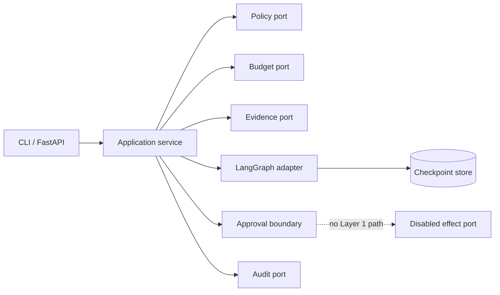

# Aegis Framework Platform

[](https://github.com/mrinmoyece/aegis-framework-platform/actions/workflows/ci.yml)
[](https://github.com/mrinmoyece/aegis-framework-platform/actions/workflows/codeql.yml)

A framework-first, educational implementation of an enterprise checkout-incident
response product. It is the comparison counterpart to the custom event-ledger Aegis:
same scenario and safety questions, but built around proven frameworks so delivery
speed, code volume, ergonomics, correctness, lock-in, and escape costs can be
measured rather than debated.

**Layer 1 is an investigation foundation, not an autonomous remediation system.**
It runs:

> checkout telemetry alert -> deterministic evidence -> telemetry/change
> specialists -> cited hypothesis -> critic -> approval-required rollback proposal
> -> append-only local audit

It does **not** approve, execute, or verify a production change. The effect adapter
always raises `EffectsDisabled`, even if passed a forged approval.

## Quick start

Prerequisites: [uv 0.12.5](https://docs.astral.sh/uv/), Docker for the container
targets, and Python 3.14.7 (uv installs it from `.python-version`).

```bash
make bootstrap
make demo
make eval
make ci
```

Run the API:

```bash
make serve
curl --fail-with-body \
  -H 'Content-Type: application/json' \
  -H 'X-Tenant-ID: tenant-acme' \
  -H 'X-Subject-ID: responder-alice' \
  -H 'X-Roles: incident-responder' \
  -H 'X-Request-ID: readme-001' \
  --data @examples/investigation-request.json \
  http://127.0.0.1:8000/v1/investigations
```

No credentials or network model calls are used. The successful result contains one
deterministically ordered, hash-cited hypothesis, a critic verdict, a rollback
**proposal**, and a separate pending approval record.

## Why these frameworks?

| Concern | Layer 1 choice | Decision |
|---|---|---|
| Agent graph | LangGraph 1.2.11 | Selected for typed, bounded fan-out/fan-in and checkpoints |
| External durability | Temporal Python 1.31.0 | Deferred until effects cross process/service boundaries |
| Framework observability/evals | Langfuse 4.14.4 | Primary optional backend; manual minimized payloads only |
| Portable telemetry | OpenTelemetry 1.44.0 | Always the application instrumentation boundary |
| API and contracts | FastAPI 0.141.1 + Pydantic 2.13.4 | Selected |
| Durable graph checkpoints | PostgreSQL 17 + LangGraph saver 3.1.2 | Adapter and Compose profile supplied; memory is demo-only |
| Vector search | pgvector 0.8.6 | Image present, retrieval deliberately deferred |
| Cache/queue | Redis | Rejected: no Layer 1 requirement justifies another state owner |
| Live models | OpenAI/Anthropic adapters | Deferred; a provider-neutral structured-model port is exercised by a fake |

See the evidence, licenses, operational dependencies, limitations, and exit plans in
[the framework selection report](docs/framework-selection.md).

## Authority is not graph state

LangGraph controls node scheduling and checkpoint state. It never grants authority.
Before graph execution, the application service independently enforces tenant-aware
identity, deny-by-default policy, idempotency, and budget. After graph execution, it
validates the tenant boundary, opens a separate approval request, and writes an audit
record. A checkpoint cannot become an approval, audit event, fencing token, tenant
grant, or effect receipt.



The full boundary rules are in [architecture](docs/architecture.md) and
[authority boundaries](docs/authority-boundaries.md).

## Deterministic safety cases

`evals/cases.json` defines success, contradiction/abstention, prompt injection,
budget exhaustion, and tenant isolation. They run without real models or network
access. The same suite can publish aggregate pass counts—not prompts, evidence, or
identifiers—to Langfuse with `--publish-langfuse`.

Tests cover graph routing, typed state validation, checkpoint/duplicate behavior,
citation integrity, injection containment, tenant isolation, budget exhaustion,
malformed provider output, adapter failures, audit integrity, API/CLI behavior, and
redaction. Branch coverage is enforced at 90%; the committed Layer 1 result is
reported by CI.

## Learning map

- [Architecture and sequence](docs/architecture.md)
- [Framework-owned vs enterprise-owned state](docs/authority-boundaries.md)
- [End-to-end tutorial](docs/tutorial.md)
- [What each framework does and does not do](docs/framework-selection.md)
- [Failure modes](docs/failure-modes.md) and [threat model](docs/threat-model.md)
- [Known limitations](docs/limitations.md)
- [16-capability roadmap](docs/roadmap.md)
- [Equivalent experiment protocol](docs/experiment-protocol.md)
- [Interview questions](docs/interview-questions.md) and [glossary](docs/glossary.md)
- [Machine-readable parity](comparison/parity-manifest.json) and
  [measurements](comparison/layer1-metrics.json)

## Repository commands

| Command | Purpose |
|---|---|
| `make lint` | Ruff format and lint checks |
| `make type` | Strict mypy |
| `make test` | Tests with meaningful branch coverage |
| `make eval` | Five deterministic safety evals |
| `make docs` | Documentation, manifest, action-pin, and image-pin validation |
| `make security` | Bandit and dependency vulnerability audit |
| `make container` | Digest-pinned, non-root application image |
| `docker compose up --build app` | Containerized demo API |
| `docker compose --profile durable up -d postgres` | Optional PostgreSQL/pgvector dependency |
| `make measure` | Refresh source LOC, dependency, and local runtime data |

The project is licensed under the [MIT License](LICENSE). Security reporting and
the explicit non-production status are documented in [SECURITY.md](SECURITY.md).
