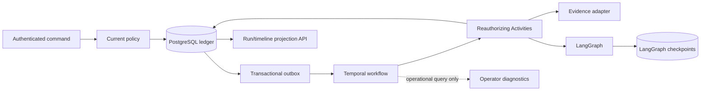

# Layer 4 governed model gateway architecture

## Product boundary

Layer 4 accepts a tenant-authorized investigation command, records immutable
application intent, schedules a crash-resilient lifecycle, runs the existing bounded
LangGraph investigation, optionally waits for a signal, and publishes application-owned
status and timeline projections.

It still cannot approve, execute, or verify a production change. Official provider
adapters are implemented but live provider qualification and credential brokering remain
deferred, as do live evidence connectors, controlled effects/approvals, sandboxing,
memory/RAG, UI/BFF, MCP/A2A, and production deployment.

## Three durable owners

| Owner | Owns | Never authoritative for |
|---|---|---|
| PostgreSQL application ledger | Tenant/aggregate event order, command idempotency, inbox/outbox, run projection, audit facts | Framework scheduling or graph checkpoints |
| Temporal 1.29.1 server + Python SDK 1.31.0 | Cross-process scheduling, Activity retry/backoff, durable timers, signals, cancellation delivery, workflow replay | Tenant grants, policy, quota, audit, API status, external-effect truth |
| LangGraph 1.2.11 | Bounded cognitive fan-out/fan-in, reducers, specialist/critic state, graph checkpoints | Workflow lifecycle, authorization, audit, idempotency, approval, effects |
| Official OpenAI 3.1.0 / Anthropic 0.122.0 SDKs | Provider HTTP protocol and response decoding | Routing, policy, pricing, budget, usage, safety, retry truth |

Framework histories and checkpoints can be deleted and reconstructed operationally
without changing application facts. Losing the application ledger is data loss.



## Command and execution order

1. FastAPI establishes `IdentityContext`; no body, signal, workflow payload, graph
   state, or evidence value establishes a tenant.
2. Current policy authorizes the exact tenant/action/purpose/risk.
3. One application transaction claims `(tenant_id, request_id, fingerprint)`, appends
   `investigation.requested`, advances the commit-order tenant cursor, builds the
   run projection, and inserts the Temporal start outbox message.
4. A race-safe dispatcher claims outbox rows with a bounded lease. Delivery retries use
   the same message/workflow ID. Five failed claims become an explicit dead-letter row.
5. Temporal starts one opaque workflow ID. Workflow history contains only bounded
   tenant/actor/request/run references, never raw evidence, credentials, prompts, or
   identity grants. No tenant ID is placed in search attributes; no custom search
   attribute is required.
6. Before every Activity, application code resolves opaque references to current
   application authority and reevaluates policy. The initial authorization Activity
   reserves budget once by run ID before evidence or LangGraph work.
7. Evidence collection persists a content-hashed application artifact. The next
   Activity reloads it, validates tenancy/integrity, and invokes one bounded LangGraph
   run. Temporal does not retry individual graph nodes.
8. Graph output is persisted as an application result event. Optional wait/resume,
   cancellation intent, timeout, completion, and failure are separate events.
9. The API reads application projections under current authorization. Temporal queries
   are operational convenience and are never returned as product truth.

## Immutable event envelope

`ApplicationEvent` is additive and strict:

- tenant, aggregate type/ID and aggregate sequence;
- commit-order tenant cursor;
- event ID/type, occurrence time, schema version;
- opaque actor/correlation/causation references;
- bounded JSON payload;
- aggregate previous hash, tenant previous hash, and record hash.

Append locks the aggregate head and tenant cursor, checks `expected_version`, computes
both chains, writes events/outbox/idempotency/projections, and advances heads in one
transaction. Rollback leaves no cursor gap or orphaned message. Event IDs are unique
per tenant. Runtime privileges plus a trigger reject event/idempotency/inbox mutation.

Version-zero legacy events are upcast explicitly into version-one envelopes; replay
never guesses a schema. Projection rebuild folds events in tenant cursor order and
stores a checkpoint containing cursor, hash, and rebuild version. Read models are
derived and replaceable.

## Inbox, outbox, and stale work

- Inbox message IDs suppress duplicate external commands. Payload hashes and typed
  command records remain tenant-scoped facts.
- Outbox claims use `FOR UPDATE SKIP LOCKED` in PostgreSQL and compare
  claim-token/attempt on completion. Expired claims can be reclaimed.
- Intent is committed before delivery or an Activity with I/O. Result/failure is
  committed after it. No code claims exactly-once external behavior.
- Aggregate state transitions reject a graph result after cancellation/terminal state.
- Activity operation IDs make duplicate Activity delivery idempotent.
- Poison payloads fail strict Pydantic and 64 KiB codec bounds; permanent failures are
  non-retryable and cannot repeatedly crash a worker fleet.

## Temporal workflow

`AegisInvestigationWorkflow` is sandboxed and deterministic. It performs no database,
network, filesystem, random, or wall-clock I/O. It uses only Temporal Activities,
`workflow.wait_condition`, and workflow history. The lifecycle is:

```text
authorize/reserve -> collect evidence -> run LangGraph
  -> [record wait -> authorize resume | cancel intent | timeout]
  -> complete | fail
```

Activities have five-minute attempt, fifteen-minute schedule-to-close, thirty-second
heartbeat timeout with ten-second periodic heartbeats, and three-attempt exponential
retry bounds. Blocking application adapters run outside the worker event loop.
Validation, authorization,
idempotency, integrity, and framework-defect errors are non-retryable. Declared
transient application failures are retryable. LangGraph/provider retries must remain
disabled or independently bounded so they do not overlap Temporal retry ownership.

The initial code path records `workflow.patched("aegis-investigation-lifecycle-v1")`.
Future incompatible changes use patch/deprecate/remove or Worker Versioning and must
replay committed representative histories before release. Continue-as-new is not used:
the workflow has one bounded investigation, at most 32 accepted resume commands, one
idempotent cancellation command, and a two-day execution cap. Add it only if measured
histories approach server limits.

## Cancellation, timeout, and recovery

Application cancellation intent is persisted before a Temporal cancel signal. The
workflow checks cancellation between Activities and records terminal `cancelled`
through the authoritative inbox command. A stale Activity result cannot move
`cancel_requested` back to running/completed. Abrupt worker
loss leaves the Temporal workflow scheduled; another worker replays history and resumes
the pending Activity. Activity heartbeat timeout detects a lost attempt. Workflow
timeout produces an application `timed_out` event.

If Temporal history is unavailable but the application ledger remains intact, the
reconciler reissues pending outbox intent under the same workflow ID or marks an
explicit platform failure. If LangGraph checkpoints are unavailable, a bounded graph
Activity may rerun under the same application operation and budget reservation. Neither
case fabricates completion.

## Tenancy, privacy, and observability

Every Layer 3 table forces RLS under the non-superuser, non-`BYPASSRLS`
`aegis_runtime` role. Worker claims are tenant-scoped. Temporal payloads use encrypted,
authenticated tenant references plus hash-derived actor/request references and bounded
Pydantic conversion. Tenant-RLS actor bindings map an actor reference back to the
current application principal; current grants are reloaded rather than copied to
history. Signals carry only a command reference; the Activity loads the authoritative
inbox command and current signaller.

Temporal's OpenTelemetry interceptor is optional and exports framework operation
spans, not payload contents. Application spans keep fixed names and allowlisted
low-cardinality count/status attributes. Tenant IDs, actor IDs, request IDs, evidence
locators, prompts, completions, credentials, and payload bodies are not exported.
Langfuse remains model/graph telemetry only; automatic LangGraph/LangChain capture is
disabled.

## API truth

`POST /v1/durable-investigations` returns `202` after durable application intent, not
workflow completion. Authorized routes expose a redacted run view and opaque
HMAC-protected cursor timeline. Timeline entries contain only cursor, event type,
timestamp, status, and bounded failure code. Payloads and tenant IDs are not returned.

## Replaceability

- `ActivityOperations` and the application outbox isolate the Temporal SDK/server.
- `OrchestratorPort` isolates LangGraph.
- PostgreSQL data is application-schema SQL with canonical JSON export and deterministic
  rebuild.
- `PolicyPort`, `BudgetPort`, `EvidencePort`, and current-authority resolution remain
  provider-neutral.

Removing Temporal requires a replacement that passes the worker loss, timer, retry,
signal, cancellation, duplicate delivery, and replay suite. Removing LangGraph does not
change the workflow or ledger contracts.

## Model call control order

`GatewayStructuredModel` translates a typed specialist task into neutral messages and a
strict JSON Schema. No vendor object crosses the adapter boundary.

1. Reload the current tenant model policy; deny unknown tenant, purpose,
   classification, risk, provider, model, region, capability, context, or pricing.
2. Resolve deterministic catalog routes and calculate a conservative token ceiling.
3. Reserve the worst-case token/cost envelope across bounded routes/repair attempts.
4. Append immutable `requested` intent with stable tenant/run/call/attempt IDs and
   request digest before network intent.
5. Invoke one official SDK adapter with SDK retries disabled. Aegis owns bounded repair,
   fallback, concurrency/rate limiting, and circuit state inside the Activity attempt.
6. Recheck current policy and cancellation before accepting output. Stale output is
   settled for billing but rejected from graph state.
7. Append `settled` success/failure/ambiguous billing fact and update replaceable usage
   and derived health projections.

Temporal may retry the graph Activity only when the application operation is still safe.
An existing model call intent suppresses a second provider call until reconciliation.
A provider may have billed a timeout/crash window; the ledger reports ambiguity and never
claims exactly once.

## Structured generation and safety

Message, content, tool, schema, usage, price, policy, and error contracts are immutable
strict Pydantic models with byte/token/count bounds and canonical SHA-256 digests.
Evidence is framed as untrusted data after fact allowlisting. Tools must exactly match the
application allowlist. Provider output can populate only the declared schema; specialist
identity and evidence citations are revalidated, malformed output receives at most the
policy repair bound, and unsafe/unsupported output becomes abstention. Model-created
roles, policy, approval, credentials, or effect intent have no application path.

## Model operations API

Current policy authorizes redacted `/v1/models/catalog`, `/v1/models/usage/{run_id}`, and
`/v1/models/health`. Catalog views omit tenant and credential references. Usage/cost facts
come from the application ledger. Health is a replaceable projection of observed outcomes,
not provider or product truth. Forced RLS applies to every Layer 4 model table.
