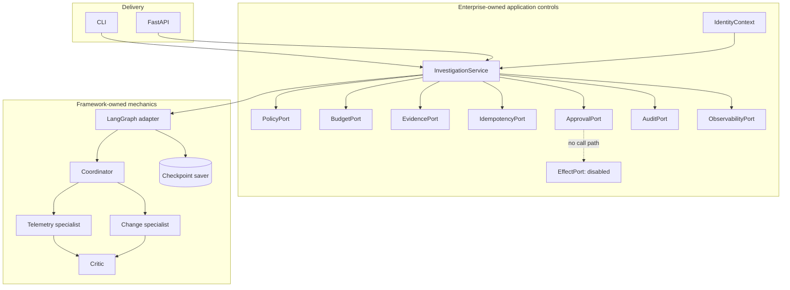
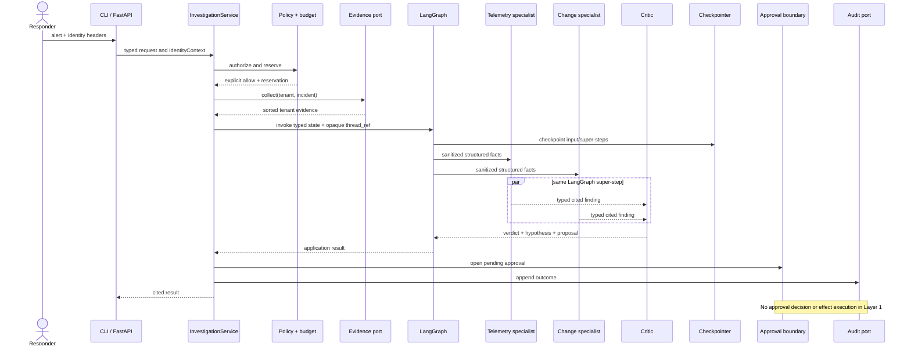
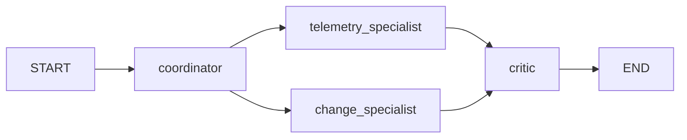

# Layer 1 architecture

## Product journey

The canonical target journey is:

1. checkout telemetry raises a tenant-scoped alert;
2. evidence is collected and integrity-addressed;
3. telemetry and change specialists investigate in parallel;
4. hypotheses cite evidence;
5. a critic rejects contradictions, malformed output, and invalid citations;
6. a remediation proposal crosses an approval boundary;
7. an approved, fenced effect executes;
8. independent verification reconciles intended and observed state;
9. durable audit records the complete chain.

Layer 1 executes steps 1–6 only, where step 6 means **opening a pending approval
request**. It appends educational in-memory audit events for the executed steps. It
has no approval decision endpoint, effect, production verification, or durable audit
store, and makes no claim that steps 7–9 run.

## Components

`ports.py` is the stable application seam. `graph.py`, `postgres.py`, and
`langfuse_adapter.py` contain framework-specific behavior. `adapters.py` contains
deterministic local enterprise-control doubles; they demonstrate boundaries but are
not production storage.

## Sequence

## Graph semantics

The graph has one bounded pass:

The two specialists share a LangGraph super-step and join before the critic.
Reducers sort/deduplicate findings, so scheduler completion order cannot change the
result. There is no model-directed routing and no loop; `recursion_limit=8` is a
secondary guard. The structured fake model consumes only allowlisted facts.

## Checkpoint contract

`InMemorySaver` is the default only so the demo and tests have no external service.
The state is made of JSON-compatible records, and tests enable
`LANGGRAPH_STRICT_MSGPACK=true` as defense in depth. Both memory and PostgreSQL
adapters explicitly install a strict `JsonPlusSerializer`, so runtime safety does not
depend on that environment variable. The optional PostgreSQL adapter calls
`PostgresSaver.setup()` and is the production-shaped checkpoint path.

A checkpoint guarantees recoverable graph state at framework super-step boundaries
when the selected saver persists successfully. It does not guarantee:

- authorization or tenant access to that state;
- idempotency of external calls or effects;
- approval integrity;
- append-only audit;
- exactly-once execution;
- retention, erasure, backup, or regional policy;
- safe streaming—LangGraph value streaming can expose private channels unless
  outputs are explicitly filtered.

The service reauthorizes checkpoint reads and derives the opaque, tenant-bound thread
reference rather than accepting an arbitrary one.

## Replaceability

- Replace LangGraph by implementing `OrchestratorPort`; domain models and controls
  do not import LangGraph.
- Replace Langfuse by implementing `ObservabilityPort`; OpenTelemetry remains the
  portable signal format.
- Replace PostgreSQL saver construction inside `postgres.py`; it is not an
  authorization or audit database.
- Add OpenAI or Anthropic through `StructuredModelPort`; provider output still passes
  Pydantic and citation validation.
- Introduce Temporal outside the graph when durable effects arrive. Temporal owns the
  effect workflow; LangGraph owns investigation. Neither nests the other's retries.
