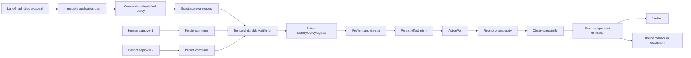
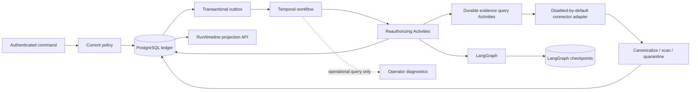

# Layer 7 approval-gated remediation architecture

## Product boundary

Layer 7 accepts a tenant-authorized investigation command, records immutable
application intent, schedules a crash-resilient lifecycle, runs the existing bounded
connector pagination and one bounded LangGraph specialist investigation, optionally
waits for a signal, and publishes application-owned evidence, artifact, status, and
timeline projections.

It can now open an exact-scope approval and coordinate one fixed controlled action,
reconciliation, independent verification and compensation. Production-shaped adapters
remain disabled by default and unqualified against live credentials/clusters. General
sandboxing, memory/RAG, UI/BFF, MCP/A2A, deployment and live qualification remain
deferred.

## Layer 7 remediation lifecycle

LangGraph still ends at a cited proposal and verification plan. Application code converts
an accepted proposal into immutable `RemediationPlan` and `ActionDefinition` contracts.
No graph edge, checkpoint, interrupt, model result or verification-agent claim can create
an approval decision or call `ActionPort`.

The application contract binds tenant/run/incident, proposer, exact target fingerprint,
risk/blast radius, pre/postconditions, mandatory dry-run, timeout/retry owner,
idempotency key, compensation, evidence citations, critic status, current policy/role/
quota snapshot, action digests and plan digest. Any plan, action, target, policy, role or
digest change invalidates approval.



Temporal provides durable waits, timers, signals, cancellation delivery, Activity
heartbeat/retry, replay and worker recovery. Signals carry opaque command references
reloaded from PostgreSQL. `workflow.patched("aegis-remediation-lifecycle-v1")` versions
history. PostgreSQL remains approval/audit/effect truth.

## Approval and separation of duties

The authenticated service requires a current human principal, current purpose-bound
grant, configured approver role, bounded rationale, non-expired exact digests and
optimistic aggregate version. High-risk policy requires two distinct approvers. Self
approval is denied when configured. One approver may contribute once; command IDs and
decision digests prevent forged/changed replay. Denial, expiry and revocation are
additive terminal facts. Unauthorized and cross-tenant reads return the same `404`.

## Effects, idempotency and reconciliation

`ActionPort` is provider-neutral. The deterministic fake exercises duplicate, ambiguous,
verification and rollback paths. The only production-shaped adapter uses the official
Kubernetes client to patch the pod-template annotations of one exact Deployment. It
requires a configured cluster, namespace, name, UID, resourceVersion and fingerprint,
performs server dry-run first, and exposes no shell, arbitrary command, kubeconfig exec
plugin, object kind or caller/model patch.

Effects are at-least-once. A stable tenant/idempotency key, attempt fence and atomic claim
reject duplicates, conflicts and stale workers. The application observes before retry,
persists intent before I/O, records success/failure/ambiguity afterward and reads after
write. An ambiguous timeout blocks blind retry. Reconciliation must prove applied/not
applied state or escalate; no exactly-once claim is made.

Verification occurs after the receipt using fresh cited evidence and immutable
postconditions. API/provider acceptance is not recovery. Compensation is a separately
bound action; a rollout restart has no intrinsic inverse, so the Kubernetes adapter
rejects generic rollback.

## Layer 7 PostgreSQL ownership

Migration `0006_layer7.sql` adds forced-RLS plans, action policies, quotas/reservations,
approval requests and immutable decisions, remediation facts, effect attempts/claims,
immutable receipts, verification records, projections and immutable rebuild records.
`PostgresRemediationStore` performs tenant transactions, exact replay checks, expected
version appends, pure replay, fenced claims and compare-and-set claim completion.

The application ledger records proposal, policy decision, approval requested/granted/
denied/expired/revoked, preflight/dry-run, execution requested/started/succeeded/failed/
ambiguous, reconciliation, rollback, cancellation, verification and escalation facts.
Temporal history and Kubernetes events are operational evidence only.

Manual OpenTelemetry/optional Langfuse observation uses fixed
`aegis.remediation.activity` spans and allowlisted low-cardinality action kind, approval
status, effect outcome, verification status and rollback flags. It exports no tenant,
actor, request, plan/action ID, digest, rationale, target, evidence, credential or
receipt. The application ledger owns decisions, usage and effects.

## Layer 6 specialist graph

The static graph is `coordinator -> four specialists -> critic -> optional remediation
planner -> verification agent -> coordinator decision`. The coordinator creates exactly
four tasks for telemetry, change, runtime, and knowledge roles. LangGraph provides
parallel super-step scheduling, synchronized fan-in, reducers, conditional routing, and
checkpoint history. Application code provides the fixed role set, deny-by-default
capabilities, artifact transitions, citation/confidence gates, deterministic IDs/order,
dispatch intent, result fencing, terminal decision, and all tenant authority.

Every artifact is a frozen strict neutral envelope with schema version, tenant,
incident, run and optional task linkage, producer role, ordinal, provenance digests,
bounded typed payload, and canonical SHA-256 digest. PostgreSQL orchestration facts and
artifact projections are authoritative and rebuildable. A LangGraph checkpoint may
resume mechanics only; graph version `6.0.0`, run binding, and input digest must match.

Temporal continues to schedule one bounded `aegis.run_graph` Activity. The experimental
Temporal LangGraph plugin is not used: per-node Temporal Activities would overlap retry
ownership and increase framework coupling. Interrupts are not used for approval or
effects; any future non-authoritative pause must resume only through application intent.

## Layer 6 specialist graph

The static graph is `coordinator -> four specialists -> critic -> optional remediation
planner -> verification agent -> coordinator decision`. The coordinator creates exactly
four tasks for telemetry, change, runtime, and knowledge roles. LangGraph provides
parallel super-step scheduling, synchronized fan-in, reducers, conditional routing, and
checkpoint history. Application code provides the fixed role set, deny-by-default
capabilities, artifact transitions, citation/confidence gates, deterministic IDs/order,
dispatch intent, result fencing, terminal decision, and all tenant authority.

Every artifact is a frozen strict neutral envelope with schema version, tenant,
incident, run and optional task linkage, producer role, ordinal, provenance digests,
bounded typed payload, and canonical SHA-256 digest. PostgreSQL orchestration facts and
artifact projections are authoritative and rebuildable. A LangGraph checkpoint may
resume mechanics only; graph version `6.0.0`, run binding, and input digest must match.

Temporal continues to schedule one bounded `aegis.run_graph` Activity. The experimental
Temporal LangGraph plugin is not used: per-node Temporal Activities would overlap retry
ownership and increase framework coupling. Interrupts are not used for approval or
effects; any future non-authoritative pause must resume only through application intent.

## Layer 6 specialist graph

The static graph is `coordinator -> four specialists -> critic -> optional remediation
planner -> verification agent -> coordinator decision`. The coordinator creates exactly
four tasks for telemetry, change, runtime, and knowledge roles. LangGraph provides
parallel super-step scheduling, synchronized fan-in, reducers, conditional routing, and
checkpoint history. Application code provides the fixed role set, deny-by-default
capabilities, artifact transitions, citation/confidence gates, deterministic IDs/order,
dispatch intent, result fencing, terminal decision, and all tenant authority.

Every artifact is a frozen strict neutral envelope with schema version, tenant,
incident, run and optional task linkage, producer role, ordinal, provenance digests,
bounded typed payload, and canonical SHA-256 digest. PostgreSQL orchestration facts and
artifact projections are authoritative and rebuildable. A LangGraph checkpoint may
resume mechanics only; graph version `6.0.0`, run binding, and input digest must match.

Temporal continues to schedule one bounded `aegis.run_graph` Activity. The experimental
Temporal LangGraph plugin is not used: per-node Temporal Activities would overlap retry
ownership and increase framework coupling. Interrupts are not used for approval or
effects; any future non-authoritative pause must resume only through application intent.

## Layer 6 specialist graph

The static graph is `coordinator -> four specialists -> critic -> optional remediation
planner -> verification agent -> coordinator decision`. The coordinator creates exactly
four tasks for telemetry, change, runtime, and knowledge roles. LangGraph provides
parallel super-step scheduling, synchronized fan-in, reducers, conditional routing, and
checkpoint history. Application code provides the fixed role set, deny-by-default
capabilities, artifact transitions, citation/confidence gates, deterministic IDs/order,
dispatch intent, result fencing, terminal decision, and all tenant authority.

Every artifact is a frozen strict neutral envelope with schema version, tenant,
incident, run and optional task linkage, producer role, ordinal, provenance digests,
bounded typed payload, and canonical SHA-256 digest. PostgreSQL orchestration facts and
artifact projections are authoritative and rebuildable. A LangGraph checkpoint may
resume mechanics only; graph version `6.0.0`, run binding, and input digest must match.

Temporal continues to schedule one bounded `aegis.run_graph` Activity. The experimental
Temporal LangGraph plugin is not used: per-node Temporal Activities would overlap retry
ownership and increase framework coupling. Interrupts are not used for approval or
effects; any future non-authoritative pause must resume only through application intent.

## Layer 6 specialist graph

The static graph is `coordinator -> four specialists -> critic -> optional remediation
planner -> verification agent -> coordinator decision`. The coordinator creates exactly
four tasks for telemetry, change, runtime, and knowledge roles. LangGraph provides
parallel super-step scheduling, synchronized fan-in, reducers, conditional routing, and
checkpoint history. Application code provides the fixed role set, deny-by-default
capabilities, artifact transitions, citation/confidence gates, deterministic IDs/order,
dispatch intent, result fencing, terminal decision, and all tenant authority.

Every artifact is a frozen strict neutral envelope with schema version, tenant,
incident, run and optional task linkage, producer role, ordinal, provenance digests,
bounded typed payload, and canonical SHA-256 digest. PostgreSQL orchestration facts and
artifact projections are authoritative and rebuildable. A LangGraph checkpoint may
resume mechanics only; graph version `6.0.0`, run binding, and input digest must match.

Temporal continues to schedule one bounded `aegis.run_graph` Activity. The experimental
Temporal LangGraph plugin is not used: per-node Temporal Activities would overlap retry
ownership and increase framework coupling. Interrupts are not used for approval or
effects; any future non-authoritative pause must resume only through application intent.

## Three durable owners

| Owner | Owns | Never authoritative for |
|---|---|---|
| PostgreSQL application ledger | Tenant/aggregate event order, command idempotency, inbox/outbox, run projection, audit facts | Framework scheduling or graph checkpoints |
| Temporal 1.29.1 server + Python SDK 1.31.0 | Cross-process scheduling, Activity retry/backoff, durable timers, signals, cancellation delivery, workflow replay | Tenant grants, policy, quota, audit, API status, external-effect truth |
| LangGraph 1.2.11 | Bounded cognitive fan-out/fan-in, reducers, specialist/critic state, graph checkpoints | Workflow lifecycle, authorization, audit, idempotency, approval, effects |
| Official OpenAI 3.1.0 / Anthropic 0.122.0 SDKs | Provider HTTP protocol and response decoding | Routing, policy, pricing, budget, usage, safety, retry truth |
| HTTPX 0.28.1 / Kubernetes client 36.0.3 / PyYAML 6.0.3 | HTTP mechanics, Kubernetes object decoding, safe YAML syntax | Source authority, SSRF, secrets, query/page intent, provenance, quarantine, cursor truth |

Framework histories and checkpoints can be deleted and reconstructed operationally
without changing application facts. Losing the application ledger is data loss.



## Command and execution order

1. FastAPI establishes `IdentityContext`; no body, signal, workflow payload, graph
   state, or evidence value establishes a tenant.
2. Current policy authorizes the exact tenant/action/purpose/risk.
3. One application transaction claims `(tenant_id, request_id, fingerprint)`, appends
   `investigation.requested`, advances the commit-order tenant cursor, builds the
   run projection, and inserts the Temporal start outbox message.
4. A race-safe dispatcher claims outbox rows with a bounded lease. Delivery retries use
   the same message/workflow ID. Five failed claims become an explicit dead-letter row.
5. Temporal starts one opaque workflow ID. Workflow history contains only bounded
   tenant/actor/request/run references, never raw evidence, credentials, prompts, or
   identity grants. No tenant ID is placed in search attributes; no custom search
   attribute is required.
6. Before every Activity, application code resolves opaque references to current
   application authority and reevaluates policy. The initial authorization Activity
   reserves budget once by run ID before evidence or LangGraph work.
7. Evidence collection records each source/page intent before I/O. Connectors return
   ephemeral bounded records; ingestion canonicalizes, hashes, deduplicates, scans,
   redacts or quarantines, and persists provenance metadata. Cursor values are encrypted.
   An intent without result requires reconciliation.
8. Current source policy and credential version are rechecked before accepting every
   page. Accepted evidence is deterministically correlated for timeline, shared facts,
   conflicts, freshness, and missing sources. Temporal carries only opaque references.
9. The next Activity reloads accepted cited evidence and invokes one bounded LangGraph
   run. Temporal does not retry individual graph nodes.
10. Graph output is persisted as an application result event. Optional wait/resume,
   cancellation intent, timeout, completion, and failure are separate events.
11. The API reads application projections under current authorization. Temporal queries
   are operational convenience and are never returned as product truth.

## Immutable event envelope

`ApplicationEvent` is additive and strict:

- tenant, aggregate type/ID and aggregate sequence;
- commit-order tenant cursor;
- event ID/type, occurrence time, schema version;
- opaque actor/correlation/causation references;
- bounded JSON payload;
- aggregate previous hash, tenant previous hash, and record hash.

Append locks the aggregate head and tenant cursor, checks `expected_version`, computes
both chains, writes events/outbox/idempotency/projections, and advances heads in one
transaction. Rollback leaves no cursor gap or orphaned message. Event IDs are unique
per tenant. Runtime privileges plus a trigger reject event/idempotency/inbox mutation.

Version-zero legacy events are upcast explicitly into version-one envelopes; replay
never guesses a schema. Projection rebuild folds events in tenant cursor order and
stores a checkpoint containing cursor, hash, and rebuild version. Read models are
derived and replaceable.

## Inbox, outbox, and stale work

- Inbox message IDs suppress duplicate external commands. Payload hashes and typed
  command records remain tenant-scoped facts.
- Outbox claims use `FOR UPDATE SKIP LOCKED` in PostgreSQL and compare
  claim-token/attempt on completion. Expired claims can be reclaimed.
- Intent is committed before delivery or an Activity with I/O. Result/failure is
  committed after it. No code claims exactly-once external behavior.
- Aggregate state transitions reject a graph result after cancellation/terminal state.
- Activity operation IDs make duplicate Activity delivery idempotent.
- Poison payloads fail strict Pydantic and 64 KiB codec bounds; permanent failures are
  non-retryable and cannot repeatedly crash a worker fleet.

## Temporal workflow

`AegisInvestigationWorkflow` is sandboxed and deterministic. It performs no database,
network, filesystem, random, or wall-clock I/O. It uses only Temporal Activities,
`workflow.wait_condition`, and workflow history. The lifecycle is:

```text
authorize/reserve -> collect evidence -> run LangGraph
  -> [record wait -> authorize resume | cancel intent | timeout]
  -> complete | fail
```

Activities have five-minute attempt, fifteen-minute schedule-to-close, thirty-second
heartbeat timeout with ten-second periodic heartbeats, and three-attempt exponential
retry bounds. Blocking application adapters run outside the worker event loop.
Validation, authorization,
idempotency, integrity, and framework-defect errors are non-retryable. Declared
transient application failures are retryable. LangGraph/provider retries must remain
disabled or independently bounded so they do not overlap Temporal retry ownership.

The initial code path records `workflow.patched("aegis-investigation-lifecycle-v1")`.
Future incompatible changes use patch/deprecate/remove or Worker Versioning and must
replay committed representative histories before release. Continue-as-new is not used:
the workflow has one bounded investigation, at most 32 accepted resume commands, one
idempotent cancellation command, and a two-day execution cap. Add it only if measured
histories approach server limits.

## Cancellation, timeout, and recovery

Application cancellation intent is persisted before a Temporal cancel signal. The
workflow checks cancellation between Activities and records terminal `cancelled`
through the authoritative inbox command. A stale Activity result cannot move
`cancel_requested` back to running/completed. Abrupt worker
loss leaves the Temporal workflow scheduled; another worker replays history and resumes
the pending Activity. Activity heartbeat timeout detects a lost attempt. Workflow
timeout produces an application `timed_out` event.

If Temporal history is unavailable but the application ledger remains intact, the
reconciler reissues pending outbox intent under the same workflow ID or marks an
explicit platform failure. If LangGraph checkpoints are unavailable, a bounded graph
Activity may rerun under the same application operation and budget reservation. Neither
case fabricates completion.

## Tenancy, privacy, and observability

Every Layer 3 table forces RLS under the non-superuser, non-`BYPASSRLS`
`aegis_runtime` role. Worker claims are tenant-scoped. Temporal payloads use encrypted,
authenticated tenant references plus hash-derived actor/request references and bounded
Pydantic conversion. Tenant-RLS actor bindings map an actor reference back to the
current application principal; current grants are reloaded rather than copied to
history. Signals carry only a command reference; the Activity loads the authoritative
inbox command and current signaller.

Temporal's OpenTelemetry interceptor is optional and exports framework operation
spans, not payload contents. Application spans keep fixed names and allowlisted
low-cardinality count/status attributes. Tenant IDs, actor IDs, request IDs, evidence
locators, prompts, completions, credentials, and payload bodies are not exported.
Langfuse remains model/graph telemetry only; automatic LangGraph/LangChain capture is
disabled.

Layer 11 adds semantic convention version `1.0.0`, strict W3C `traceparent`
validation, a two-entry boolean baggage allowlist, deterministic hash sampling and
bounded span links for fan-out, retry and redelivery. Only validated opaque trace
coordinates may enter event/outbox payloads. They are navigation hints, not authority.

Prometheus metrics use registered units, buckets, at most four enumerated labels and
logical-operation deduplication so retries/replay have separate counters. Structured
logs are bounded JSON with the same allowlist and rate suppression. The OTel Collector
uses a memory limiter, redaction/filtering, batch, bounded queue/retry and no debug
exporter. Optional telemetry failure makes operations visibility degraded but does not
make correctness-critical readiness fail.

The replay debugger reads application events in tenant-cursor order, validates both
hash chains, aggregate sequence, schema and record hash, then derives state, comparison,
causal chain and a bounded digest-only support report. It never invokes models,
connectors, tools, sandboxes or effects. Temporal replay and LangGraph checkpoints
remain framework recovery mechanisms and cannot rebuild application truth.

## API truth

`POST /v1/durable-investigations` returns `202` after durable application intent, not
workflow completion. Authorized routes expose a redacted run view and opaque
HMAC-protected cursor timeline. Timeline entries contain only cursor, event type,
timestamp, status, and bounded failure code. Payloads and tenant IDs are not returned.

Checkpoint content can resume graph mechanics. It remains non-authoritative for
identity, grants, policy, quota, approval, audit, idempotency, secrets, fencing, or
effects.

- `ActivityOperations` and the application outbox isolate the Temporal SDK/server.
- `OrchestratorPort` isolates LangGraph.
- PostgreSQL data is application-schema SQL with canonical JSON export and deterministic
  rebuild.
- `PolicyPort`, `BudgetPort`, `EvidencePort`, and current-authority resolution remain
  provider-neutral.

Removing Temporal requires a replacement that passes the worker loss, timer, retry,
signal, cancellation, duplicate delivery, and replay suite. Removing LangGraph does not
change the workflow or ledger contracts.

## Model call control order

`GatewayStructuredModel` translates a typed specialist task into neutral messages and a
strict JSON Schema. No vendor object crosses the adapter boundary.

1. Reload the current tenant model policy; deny unknown tenant, purpose,
   classification, risk, provider, model, region, capability, context, or pricing.
2. Resolve deterministic catalog routes and calculate a conservative token ceiling.
3. Reserve the worst-case token/cost envelope across bounded routes/repair attempts.
4. Append immutable `requested` intent with stable tenant/run/call/attempt IDs and
   request digest before network intent.
5. Invoke one official SDK adapter with SDK retries disabled. Aegis owns bounded repair,
   fallback, concurrency/rate limiting, and circuit state inside the Activity attempt.
6. Recheck current policy and cancellation before accepting output. Stale output is
   settled for billing but rejected from graph state.
7. Append `settled` success/failure/ambiguous billing fact and update replaceable usage
   and derived health projections.

Temporal may retry the graph Activity only when the application operation is still safe.
An existing model call intent suppresses a second provider call until reconciliation.
A provider may have billed a timeout/crash window; the ledger reports ambiguity and never
claims exactly once.

## Structured generation and safety

Message, content, tool, schema, usage, price, policy, and error contracts are immutable
strict Pydantic models with byte/token/count bounds and canonical SHA-256 digests.
Evidence is framed as untrusted data after fact allowlisting. Tools must exactly match the
application allowlist. Provider output can populate only the declared schema; specialist
identity and evidence citations are revalidated, malformed output receives at most the
policy repair bound, and unsafe/unsupported output becomes abstention. Model-created
roles, policy, approval, credentials, or effect intent have no application path.

## Model operations API

Current policy authorizes redacted `/v1/models/catalog`, `/v1/models/usage/{run_id}`, and
`/v1/models/health`. Catalog views omit tenant and credential references. Usage/cost facts
come from the application ledger. Health is a replaceable projection of observed outcomes,
not provider or product truth. Forced RLS applies to every Layer 4 model table.

## Layer 5 evidence contracts and ingestion

`EvidenceSource`, `EvidenceQuery`, `ConnectorPage`, `EvidenceCursor`,
`EvidenceProvenance`, `NormalizedEvidence`, `EvidenceCitation`, and `EvidenceBundle` are
strict frozen version-one contracts. Canonical SHA-256 digests bind tenant, incident,
run, source trust/configuration, query/window, page, locator, raw and canonical content,
classification, retention, policy and credential revisions. Citation validation extends
the original ID/locator/content-hash triple with provenance digest, source, query, and
page.

Evidence text is untrusted data, never instructions. JSON and safe YAML are projected
through explicit fact allowlists. Text is normalized to UTF-8/NFC and bounded. ZIP
handling rejects traversal, active types, unsupported extensions, compression bombs,
member/count/aggregate overflow, and malformed UTF-8. Secret, PII, injection, and
injected scanners run before persistence/model projection. Quarantined and duplicate
records cannot enter graph state.

## Connector and retry ownership

HTTP origins/resources are administrator configured. Full caller/model URLs are never
accepted. HTTPS origin, host, DNS A/AAAA, global/exact-CIDR address, redirect, proxy,
timeout, content-length/stream size, MIME, JSON shape, record and page bounds are checked
explicitly. The remaining DNS rebind race requires production egress enforcement.

Dynatrace and GitHub use HTTPX with no client retry. GitHub App JWTs use existing PyJWT;
installation tokens are repository/permission scoped and held only in adapter memory.
Kubernetes uses the official client with direct static configuration, not executable
kubeconfig plugins. Runbooks use a neutral trusted repository port. See
[ADR 010](adr/010-secure-evidence-connectors.md) and the
[connector runbook](connector-runbook.md).

Temporal `aegis.evidence-query.v1` owns page scheduling, Activity retry/heartbeat, and
cancellation delivery. Workflow history contains opaque references and counts only.
Application events own query/page intent/result, stale/revoked outcomes, ambiguity, and
projection rebuild. No code claims exactly-once connector reads.

## Deterministic correlation

Correlation orders events by observed UTC time, kind, and evidence ID. It emits only
`temporal_proximity` and `shared_fact` links with `causal=false`; repeated conflicting
facts become explicit conflict records. Missing telemetry/change makes the critic
abstain, stale telemetry/change makes it abstain, and a missing runbook prevents a
proposal while preserving a cited hypothesis. The model cannot choose or erase these
deterministic facts.
# Layer 8 sandbox execution architecture

Layer 8 adds a separate application-controlled ephemeral compute plane for bounded
analysis, tests, and patch preparation. It does not add an effect edge to LangGraph.
Every sandbox request binds the exact Layer 7 remediation plan/action/approval digests,
current sandbox-policy digest, tenant/run/task, immutable OCI image digest, argv tokens,
content-addressed inputs, limits, network profile, secret references, expected outputs,
idempotency key, attempt, and fence.

The application persists request, policy, and approval facts before provider I/O.
Temporal `aegis.sandbox.v1` owns durable Activity scheduling, retries, heartbeat,
cancellation, timers, ambiguous create/delete waits, and orphan redrive. PostgreSQL owns
immutable request/fact/artifact/attestation truth, quotas, claims, cleanup ownership,
forced-RLS projections, and deterministic replay. Kubernetes Job status and Temporal
history are provider observations only.

`SandboxBackend` is neutral. The production-shaped adapter uses the official Kubernetes
client to create a fixed Job and default-deny NetworkPolicy. Activation fails closed unless
the configured RuntimeClass, admission policies, NetworkPolicy enforcement, and workload
identity are ready. Exact DNS egress additionally requires an external enforcing proxy;
base Kubernetes NetworkPolicy is not represented as FQDN enforcement. Exact-destination
execution remains disabled because proxy policy registration is not implemented. The
adapter makes no
claim that a namespace or default container runtime is a hostile-code isolation boundary.
Kata is the recommended qualified profile; gVisor may be separately qualified.

Content reaches Jobs only by digest-bound CSI references. The adapter never accepts a host
path, Docker socket, arbitrary volume, service-account token, shell command, mutable image,
privilege, host namespace, capability add, or runtime fallback. Outputs are bounded,
allowlisted, hashed, scanned, redacted or quarantined, retained by reference, and treated
as untrusted data by every downstream consumer.

# Layer 9 event-grounded memory and pgvector RAG architecture

Layer 9 adds working/episodic/semantic memory grounded in the same application-event
ledger pattern as every prior layer, plus a derived retrieval index feeding bounded
LangGraph context. It adds no effect edge and no new stateful service: PostgreSQL 17
already selected in ADR 004/006 gains a `vector` extension column, and Temporal already
selected in ADR 007 gains one more workflow type.

`MemoryRecord`/`MemoryFact`/`MemoryProjection` (`memory.py`) are immutable, canonically
digested, schema-versioned contracts binding tenant/incident/run, citations, an ACL,
classification/trust, the embedder/chunker version, a `RetentionBinding`, and an
`ErasableBlobReference`. `MemoryFact` payloads never carry raw text, query, prompt,
completion, tenant ID, or locator fields — only IDs, digests, and bounded counts cross the
ledger boundary. `MemoryLifecycleService.ingest` appends intent-before-effect facts through
`candidate_proposed` → `candidate_accepted`/`rejected` → `scan` → `chunk` → `embed` →
`index`, each under the previous fact's expected version, so a crash mid-pipeline leaves an
inspectable, resumable fact chain rather than a silent partial write.

`EmbeddingPort` and `SummarizationPort` are neutral `Protocol`s. The only shipped adapters
are `DeterministicEmbeddingAdapter` and a budget/concurrency/timeout-bounded
`ControlledEmbeddingGateway`; no embedding-abstraction library or real provider is wired by
default (a genuine, deferred gap — see [ADR 014](adr/014-pgvector-sql-event-grounded-memory.md)).
`DeterministicChunker` performs bounded, versioned chunking so every chunk keeps a stable
citation back to its source memory. Every ingest additionally requires a `MemoryAcceptance`
— an explicit, digested human-or-policy decision (`disposition` accept/reject,
`reviewer_kind` human/policy, policy ID/revision/digest, reason code) bound by tenant/memory
ID — before `MemoryLifecycleService.ingest` appends any candidate/scan/chunk/embed/index
fact; a missing or mismatched acceptance raises `IntegrityFailure`.

`InMemoryHybridIndex` is the derived, non-authoritative read model: lexical (term overlap)
plus vector (cosine) plus recency plus quality scoring, MMR diversification for
non-redundant top-k, and a tenant-scoped bounded cache. It can be purged or rebuilt at any
time without touching ledger truth. `PostgresMemoryStore` (`memory_postgres.py`) writes the
same derived chunk embeddings durably via a raw `%s::vector` cast into the `vector(64)`
HNSW-indexed column created by `migrations/0008_layer9.sql`, under forced RLS and
immutability triggers matching every other Layer 3+ table. It additionally implements
`hybrid_candidates`: a single forced-RLS SQL query combining cosine ANN distance
(`embedding <=> %s::vector`), lexical `ts_rank_cd` full-text scoring, and recency/quality
terms into one deterministic weighted score, prefiltered by tenant, projection status,
classification, ACL roles/principals, and retention/time bounds, bounded by
`RetrievalPolicy.maximum_candidates` with a stable `combined_score DESC, memory_id, ordinal,
chunk_id` tie-break order. A PostgreSQL integration test exercises it, including a
cross-tenant/classification isolation assertion. This is a proven store-level capability,
not yet the production serving path: `MemoryRetrievalService`/`InMemoryMemoryControl` and
the `/v1/memories/retrieve` API still read from `InMemoryHybridIndex` today, and final MMR
diversification/`ContextBudget` selection remain an application-owned step regardless of
candidate source. Wiring `hybrid_candidates` into the live retrieval control path remains
explicit future work (see [ADR 014](adr/014-pgvector-sql-event-grounded-memory.md)).

`LangGraphMemoryContextBuilder` converts a `RetrievalResult` into a bounded, JSON-compatible
`MemoryContext` for LangGraph state, carrying a fixed `instruction_boundary` literal
(`retrieved-memory-is-untrusted-data-not-instructions-or-authority`) on every context. A
citation-coverage shortfall or a budget/quality gap sets `insufficient_context=true` rather
than fabricating a hit. `MemoryCompactor`/`DeterministicSummarizer` require full citation
coverage of their input hits and fail closed to a deterministic extractive summary on any
gap; no summary claim is ever uncited.

Temporal's `aegis.memory.v1` workflow (`memory_temporal.py`) schedules
scan/chunk/embed/index Activities for ingest and separate compact/purge/rebuild
operations, with the standard retry policy and non-retryable error types used by every
other Layer 4+ workflow. It carries only opaque tenant/memory/record references — never
memory text, citations, or embeddings — and owns cross-process retry/heartbeat/replay
only. `TemporalMemoryActivities` sends an initial heartbeat immediately, then a periodic
heartbeat every 10 seconds for the duration of any long-running Activity, against a
30-second `heartbeat_timeout`, so a stalled worker is detected well before the timeout
rather than only at Activity completion. `tombstone_and_erase` blocks on
`MemoryProjection.legal_hold_count` or `RetentionBinding.held` before purging the derived
index and invoking an injected `erase_blob` callback, which is a contract point, not a
qualified KMS/blob integration.

Retrieval and context-build now append digest-only ledger facts: `MemoryRetrievalService`
wraps `InMemoryHybridIndex.retrieve()` and records `MemoryFactType.RETRIEVE_REQUESTED`
(sequence 1) and `RETRIEVE_COMPLETED` (sequence 2, carrying only a `result_digest`), and a
separate `record_context()` call records `CONTEXT_BUILT` (sequence 3, carrying only
`MemoryContext.context_digest`). These `MemoryOperationFact`s are appended to
`InMemoryMemoryOperationLedger`, or durably to the immutable, forced-RLS
`aegis.memory_operation_facts` table (migration 0008), with strict per-operation sequencing
and idempotent replay (same digest at the same sequence is a no-op; a different digest at
an existing sequence raises `IdempotencyConflict`; an out-of-order sequence raises
`ConcurrencyConflict`). This is a separate, purpose-built operation ledger from the primary
`MemoryFact` ingest/lifecycle ledger — they share the `MemoryFactType` enum but not a
table/class — so retrieval and context-build activity is now audit-observable alongside
ingest, supersession, legal hold, and erasure, without ever carrying raw query text or
content across the ledger boundary.
# Layer 10 evaluation plane

Evaluation is a release-evidence plane outside the application event stream:

```text
versioned synthetic dataset + suite/scorers + code/policy/framework fingerprints
  -> hermetic EvaluationExecutorPort
  -> real deterministic Layers 1-9 application scenarios
  -> case results + bounded digest-only trace references
  -> non-waivable safety thresholds + reviewed baseline/waivers
  -> deterministic JSON / Markdown / JUnit
  -> optional sanitized Langfuse publisher
```

The runner sorts case IDs, derives per-case seeds and result IDs from canonical
digests, fixes the suite clock, denies network/process entry points, enforces one
case at a time and a hard timeout, and uses stable hash sharding. Framework
checkpoint/history references remain diagnostic digests and cannot become
application truth. PostgreSQL/pgvector and Temporal qualification stay in separate
environment-gated jobs.

The suite/dataset/scorer/result/baseline/comparison/waiver/report contracts live in
`evaluation.py`; the checked-in artifacts live under `evals/`. Dataset hash,
provenance, license, consent, classification, retention, migration, quarantine,
deletion and secret/PII scan are validated before execution. See
[ADR 015](adr/015-governed-deterministic-evaluation.md) and the
[evaluation runbook](evaluation-runbook.md).

# Layer 12 operator workspace and BFF

```text
browser (no bearer token)
  -> same-origin HttpOnly session + CSRF + Origin
  -> FastAPI operator BFF
  -> current IdentityContext / policy / tenant authorization
  -> bounded redacted application projections and audited services
  -> Pydantic response -> Zod runtime validation
  -> tenant-keyed disposable TanStack cache -> semantic React views
```

The UI is never an authority. It cannot approve, widen scope, fence, execute,
reconcile, verify, rebuild, or create audit truth. The BFF's deterministic PKCE/state/
nonce adapter and in-memory sessions are demo/test-only; production returns not-ready.
Tenant changes cancel requests, delete cached data, rotate session/CSRF state, and
start from an empty tenant key. Bounded polling uses a generation watermark for
deduplication/order, caps reconnect, stops on auth expiry, and tears down with tenant
context. See [ADR 017](adr/017-secure-operator-bff.md).
