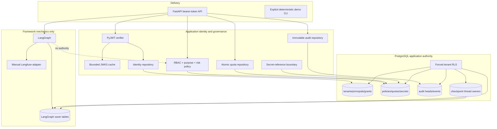
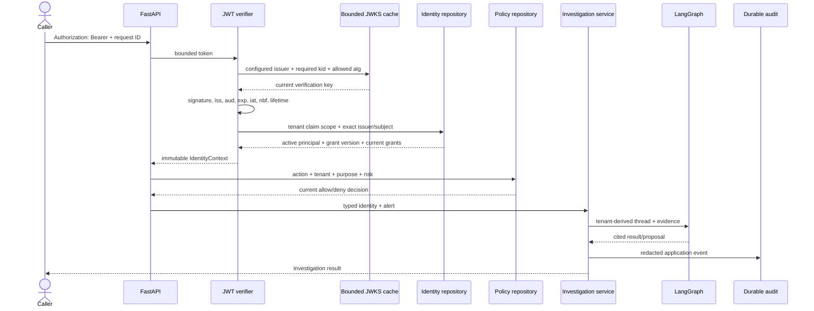

# Layer 2 architecture

## Product boundary

The product still investigates checkout incidents and opens a pending approval. It
does not approve, execute, or verify a production change. Layer 2 makes identity,
tenancy, authorization, quota, secrets references, checkpoints, and audit
production-shaped without expanding the effect boundary.

The journey remains:

1. authenticate a human or workload access token at delivery;
2. resolve the authoritative principal and tenant from application storage;
3. evaluate a current purpose-bound grant and tenant policy;
4. reserve tenant quota before evidence or graph work;
5. investigate with the bounded LangGraph graph;
6. open a pending approval outside the graph;
7. append redacted application audit.

Steps for approval decisions, effects, fencing, verification, and reconciliation
remain absent.

## Components and authority



`ports.py` and `access.py` are provider-neutral boundaries. `identity.py` owns JOSE
and JWKS mechanics. `authorization.py` owns immutable role definitions and current
policy evaluation. `postgres.py` is the PostgreSQL/Psycopg/LangGraph-saver adapter.
LangGraph and Langfuse never approve or grant access.

## Authentication sequence



Unverified token content may select only an exact preconfigured issuer and an RLS
scope. It cannot establish a tenant: the resolved `(issuer, subject)` principal must
exist in that tenant and its application `grant_version` must match the token.
Application grants—not token roles—produce immutable role/purpose/permission/risk
bindings. Human and workload identities use the same contract with an explicit
`principal_kind`.

The verifier:

- accepts only configured `RS256`, `PS256`, or `ES256`;
- requires a bounded `kid` and rejects `crit` and unexpected token types;
- verifies signature, exact issuer, configured audience, and required claims;
- applies an explicit maximum clock skew and token lifetime;
- validates `exp`, `iat`, and optional `nbf` against the injected clock;
- limits token and JWKS response size, key count, key use, operations, and algorithms;
- refreshes on expiry or an unfamiliar key after a cooldown;
- never uses stale keys after a refresh failure.

## Authorization and anti-enumeration

Every service run and checkpoint read uses `PolicyPort`. Delivery routes use the same
policy for tenant, policy, quota, and audit reads. A decision requires all of:

- resource tenant equals identity tenant;
- identity and grant have not expired;
- current tenant policy exists and permits the action/purpose/risk;
- one immutable current grant permits that exact action for that purpose and risk.

Missing and forbidden tenant resources both return `404`; investigation denial is a
generic `403`; authentication failures are generic `401`. Responses never explain
whether another tenant's object exists.

| Route | Authentication | Required permission |
|---|---|---|
| `GET /healthz` | none; liveness only | none |
| `GET /readyz` | none | production identity and governance configured |
| `GET /v1/me` | bearer token | current authenticated principal |
| `GET /v1/tenants/{tenant_id}` | bearer token | `tenant:read` |
| `GET /v1/policies/current` | bearer token | `policy:read` |
| `GET /v1/quotas/investigations` | bearer token | `quota:read` |
| `GET /v1/audit` | bearer token | `audit:read` |
| `POST /v1/investigations` | bearer token | `investigation:run` |

The deterministic static bearer identities exist only when `AEGIS_MODE=demo` or an
explicit test runtime is injected. The default is production mode. Missing OIDC or
PostgreSQL settings leave readiness and authenticated routes closed.

## PostgreSQL transaction and RLS boundary

`migrations/0001_layer2.sql` creates tenant-first keys/indexes for tenants,
principals, grants, policies, quotas/reservations, secret references, audit, and
checkpoint owners. Every tenant table enables and forces RLS using:

```sql
tenant_id = aegis.current_tenant_id()
```

The runtime login must be a member of `aegis_runtime`. Pool configuration executes
`SET ROLE aegis_runtime`, enables row security, verifies the role is neither
superuser nor `BYPASSRLS`, and applies statement/lock/idle-transaction timeouts.
Every repository call uses `set_config(..., true)` inside one transaction. Both the
transaction helper and pool reset hook reject leaked tenant state.

Policy and quota updates use version predicates. Quota reservation serializes the
tenant/reservation key, locks the quota row, stores allow and deny decisions, and
returns the stored result on retry.

Audit uses one locked head per tenant. The application stores only a derived actor
reference and allowlisted attributes, then hashes canonical event content with the
previous tenant hash. Runtime privileges deny update/delete, and a trigger rejects
mutation even by a more privileged writer. PostgreSQL durability is audit truth;
LangGraph checkpoints and traces are not.

## Tenant-bound LangGraph persistence

Administrative setup runs `PostgresSaver.setup()` and then forces RLS on
`checkpoints`, `checkpoint_blobs`, and `checkpoint_writes`. Their policies join
`thread_id` to `aegis.checkpoint_threads` under the current tenant. Runtime setup is
not permitted.

`TenantPostgresOrchestrator` registers an opaque tenant-derived thread and performs
all saver work in the same tenant transaction. A conflicting cross-tenant thread
hits the global uniqueness constraint but remains invisible through RLS. The memory
saver also records thread ownership for deterministic tests.

Checkpoint content can resume graph mechanics. It remains non-authoritative for
identity, grants, policy, quota, approval, audit, idempotency, secrets, fencing, or
effects.

## Framework versus custom responsibilities

| Concern | Proven library/framework | Explicit application responsibility |
|---|---|---|
| JWT/JWS | PyJWT + cryptography | issuer registry, allowed algorithms, cache bounds, lifetime/skew, principal/grant resolution |
| HTTP | FastAPI/Pydantic | bearer boundary, body/token bounds, anti-enumeration, readiness behavior |
| Graph | LangGraph | policy before execution, tenant thread ownership, citation/risk/approval boundaries |
| Pool/SQL | Psycopg/PostgreSQL | forced RLS, role attributes, tenant transaction, schema and audit semantics |
| Checkpoints | LangGraph PostgreSQL saver | RLS overlay, owner registry, access authorization |
| Trace/eval | OpenTelemetry/Langfuse | allowlists, buckets, exporter redaction, no automatic graph capture |
| Policy | none selected | immutable RBAC, purposes, risk, current policy and revocation |

No second agent framework or orchestration owner is introduced.

## Replaceability and unproven evidence

- Replace PyJWT through `AuthenticatorPort`.
- Replace an IdP through configured issuer/JWKS and `(issuer, subject)` mapping.
- Replace PostgreSQL repositories through the access/governance/audit/budget ports.
- Replace LangGraph through `OrchestratorPort`.
- Replace Langfuse through `ObservabilityPort` and OpenTelemetry.

Deterministic key rotation and a local environment-gated Keycloak test exist. Live
IdP rotation under production traffic is unproven. Production deployment, TLS,
network policy, database HA/backups/restore, retention/erasure execution, KMS-backed
secret resolution, external evidence/model adapters, and all production effects are
also unproven.
