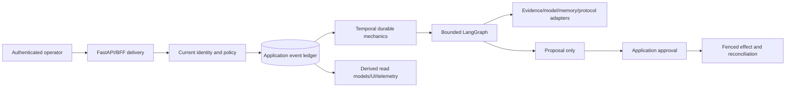
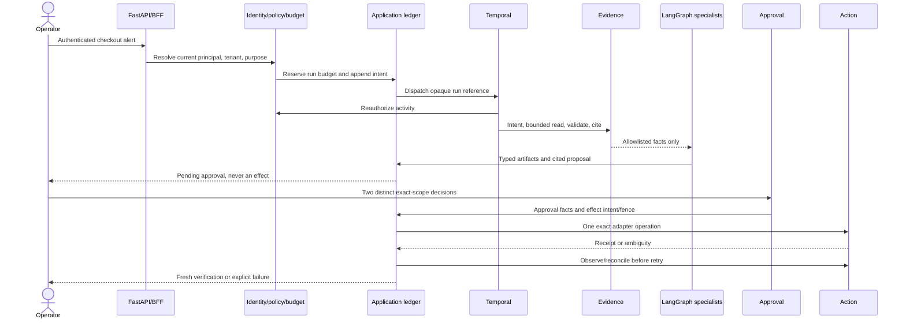

# Start-to-expert learning path

This is the primary path through the repository. Use the linked source, tests,
evals, ADRs and runbooks rather than reading appended layer notes in isolation.

## Mental model

PostgreSQL application facts are durable truth. Temporal history, LangGraph
checkpoints, pgvector rows, UI caches and Langfuse traces are replaceable mechanics
or views. See [authority boundaries](authority-boundaries.md), [architecture](architecture.md),
and [ADR index](adr/README.md).

## Checkout incident end to end

Trace it in [`service.py`](../src/aegis_framework/service.py),
[`durability.py`](../src/aegis_framework/durability.py),
[`temporal.py`](../src/aegis_framework/temporal.py),
[`graph.py`](../src/aegis_framework/graph.py), and
[`remediation.py`](../src/aegis_framework/remediation.py). Run
`make demo`, `make qualification`, and the scenarios in
[`tests/test_remediation_layer7.py`](../tests/test_remediation_layer7.py).

## Learning stages

| Stage | Read | Execute | Explain |
|---|---|---|---|
| Start | [README](../README.md), [glossary](glossary.md), [tutorial](tutorial.md) | `make demo` | why a proposal is not approval |
| Foundations | ADRs [001](adr/001-langgraph-orchestration.md), [005](adr/005-pyjwt-and-explicit-authorization.md), [008](adr/008-application-event-ledger.md) | `make test` | identity, ledger, idempotency, checkpoints |
| Durable work | [ADR 007](adr/007-temporal-durable-workflow.md), [failure modes](failure-modes.md) | `make temporal-integration` | retry ownership and ambiguity |
| Evidence/AI | ADRs [009](adr/009-provider-neutral-model-gateway.md), [010](adr/010-secure-evidence-connectors.md), [011](adr/011-governed-specialist-orchestration.md) | `make eval-adversarial` | evidence allowlists and cited artifacts |
| Controlled effects | ADRs [012](adr/012-temporal-approval-and-effects.md), [013](adr/013-kubernetes-job-sandbox.md) | `make eval-recovery` | SoD, fencing, reconciliation, sandbox fail-closed |
| Memory/protocol/UI | ADRs [014](adr/014-pgvector-sql-event-grounded-memory.md), [017](adr/017-secure-operator-bff.md), [018](adr/018-official-mcp-a2a-interoperability.md) | `make protocol frontend-ci` | derived state and bypass prevention |
| Operations | ADRs [016](adr/016-provider-neutral-observability-replay.md), [019](adr/019-production-deployment-foundations.md) | `make observability-config deployment-check restore-drill` | telemetry is not truth; restore acceptance |
| Expert | ADRs [020](adr/020-enterprise-qualification.md), [021](adr/021-final-release-governance.md) | `make ci release-check` | local qualification versus live gates |

## Labs

1. **Tenant denial:** run identity, checkpoint, PostgreSQL RLS and operator tenant
   tests; attempt to derive tenant from evidence and explain the rejection.
2. **Framework loss:** run `tests/test_release_layer16.py`; delete derived state in
   the fixture and compare rebuilt application projections.
3. **Crash and replay:** run `make eval-recovery`; map each cut in
   [`chaos-matrix.json`](../qualification/chaos-matrix.json) to intent,
   idempotency, fencing or reconciliation.
4. **Evidence attack:** run `make eval-adversarial`; add a synthetic prompt
   injection and prove it cannot become graph instruction or an uncited claim.
5. **Approval attack:** attempt self-approval, stale digests, duplicate decisions,
   stale fences and API-acceptance-as-verification.
6. **Protocol/UI bypass:** run `make protocol frontend-ci`; try peer self-asserted
   tenancy, direct effect requests, stale trust pins, missing CSRF and cross-tenant
   cache reuse.
7. **Supply chain:** expire a copied waiver fixture, mutate an Action/image pin, and
   show `make release-check`, `make docs`, or the policy checker fails closed.
8. **Restore:** run `make restore-drill` and, with Docker, `make restore-drill-db`;
   explain what still needs managed PITR/failover evidence.

## Failure and security exercises

Use [failure modes](failure-modes.md), [threat model](threat-model.md),
[security assessment](security-assessment.md), [final security review](final-security-review.md),
and [troubleshooting](troubleshooting.md). For every exercise identify the
authoritative record, the derived state that may be discarded, the retry owner,
the tenant boundary, the fail-closed result, and the live evidence still missing.

## 15/30/60-minute demonstrations

- **15 minutes:** architecture, authority matrix, deterministic checkout, one
  denial, and the precise local/live status.
- **30 minutes:** add ledger replay, framework outage, two-person approval,
  ambiguity/reconciliation, protocol proposal-only behavior, and the comparison.
- **60 minutes:** add PostgreSQL/Temporal/UI/infrastructure gates, sandbox and
  memory security, supply-chain waiver failure, restore evidence, framework exit
  paths, and residual risks.

The detailed script remains in [demo-layer15](demo-layer15.md); present Layer 16
readiness and governance as the final section rather than repeating prior layers.

## Staff/Principal interview bank

1. **Staff:** Where is each authority established, persisted, rechecked and audited?
2. **Staff:** Which retry layer owns each boundary, and how is ambiguous billing or
   effect completion reconciled?
3. **Staff:** How do evidence projection and citation checks fail closed under
   injection, revocation and partial collection?
4. **Staff:** Why are pgvector, LangGraph checkpoints, UI caches and traces derived?
5. **Principal:** When does Temporal's operational burden exceed the bespoke worker
   code it replaces?
6. **Principal:** Design a major framework migration that preserves application
   projection digests and active approval/effect safety.
7. **Principal:** Which live gates are organizational rather than technical, and
   why can CI not clear them?
8. **Principal:** Defend the absence of an aggregate score and compare the two Aegis
   implementations without cherry-picking.
9. **Principal:** Define the evidence needed before hostile sandbox execution,
   active-active regional writes, or a certification statement.

Use the larger [interview question bank](interview-questions.md) for drills. A
strong answer names concrete code/tests/evals and separates local evidence from
production claims.
